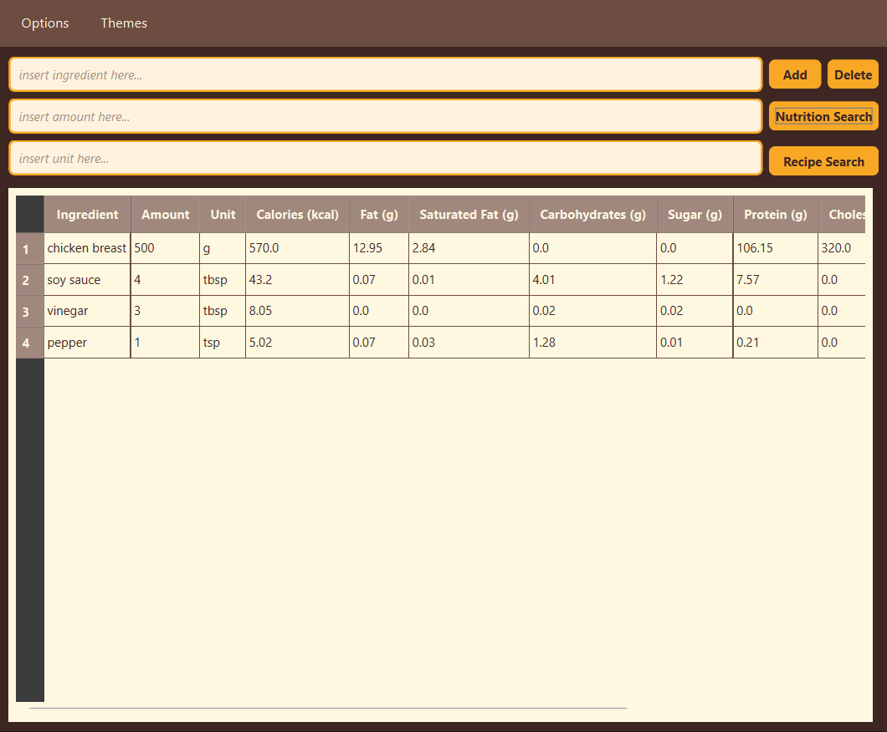
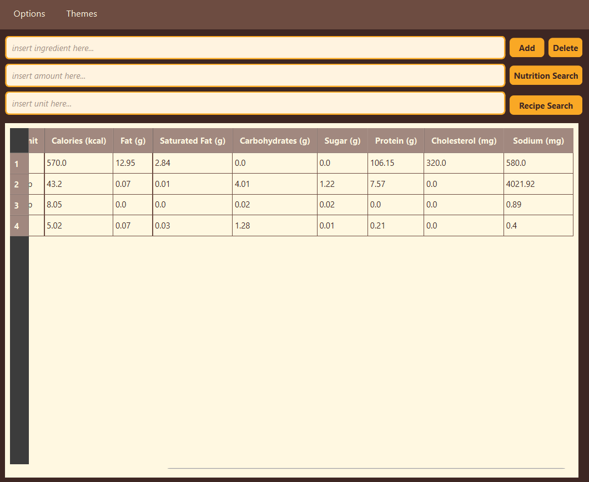
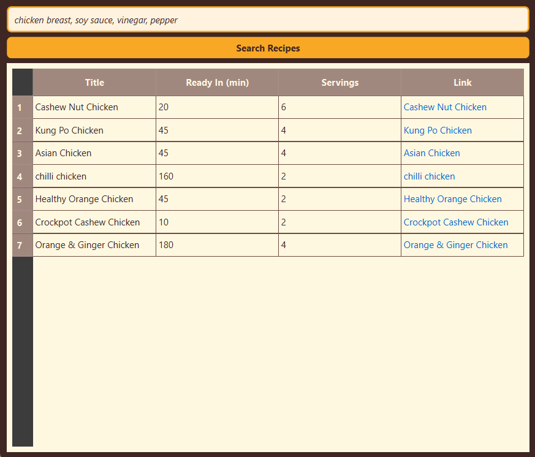

# Cheffeur Food App

```
 ██████╗██╗  ██╗███████╗███████╗███████╗███████╗██╗   ██╗██████╗ 
██╔════╝██║  ██║██╔════╝██╔════╝██╔════╝██╔════╝██║   ██║██╔══██╗
██║     ███████║█████╗  █████╗  █████╗  █████╗  ██║   ██║██████╔╝
██║     ██╔══██║██╔══╝  ██╔══╝  ██╔══╝  ██╔══╝  ██║   ██║██╔══██╗
╚██████╗██║  ██║███████╗██║     ██║     ███████╗╚██████╔╝██║  ██║
 ╚═════╝╚═╝  ╚═╝╚══════╝╚═╝     ╚═╝     ╚══════╝ ╚═════╝ ╚═╝  ╚═╝
```
# Instructions
To build this app, clone the repository using the command below:
```
git clone https://github.com/your-username/cheffeur-food-app.git
```
Navigate to the repository:
```
cd cheffeur-food-app
```
Then run the application:
```
python main.py
```
_Note: In order to **actually** run the app, you must create a file called "API_KEY_SPOONACULAR".txt that contains your own Spoonacular API Key. Due to security reasons, the team's own API keys are NOT included within this repository._

# Description
The Cheffeur Food App is a Python-based application that helps users explore nutrition data and recipes through the Spoonacular API.
Users can input ingredients based on three criteria — name, unit, and amount — to interact with the app in two main ways:

## Nutrition Search

* Calculates and displays the nutritional values (such as calories, protein, fat, and carbohydrates) of each ingredient entered.

## Recipe Search
* Finds recipes from Spoonacular that contain all of the inputted ingredients.
* Alternatively, users can skip entering ingredients and search recipes directly from the app’s built-in interface.

# Technologies Used
<a href="https://www.python.org/" target="_blank">
  
</a>
<a href="https://doc.qt.io/qtforpython-6/" target="_blank">
  
</a>
<a href="https://spoonacular.com/food-api" target="_blank">
  
</a>

# Demo
<div align="center">
  
  
  
</div>


# Team
Developed by Group 1 of OOPB.
```
list_of_names = ["Ross Andrew Bulaong", "Jerald San Interno", "Madhel Kathlyn Ann Javillonar", "John Marvin Masongsong", "Joshua Paul Pios"]
for name in list_of_names:
  print(name)
```

# Fun Fact
The name comes from combining two words: *“chef,”* someone who cooks food, and *“chauffeur,”* someone who drives a private automobile or limousine. Together, **Cheffeur** refers to someone who drives you toward good and healthy food—essentially, a chef chauffeur.

